# OpenClaw モジュラーモノリス アーキテクチャ

## 実装同期状況（2026-07-16）

本書は完成時の構成を含むアーキテクチャ設計である。現在の実装範囲は[現行実装ベースライン](../implementation/current-implementation.md)を参照する。現時点ではExpressモジュラーモノリス、46 API operation、PostgreSQL repository、Google OAuth/Gmail/Calendar adapter、Outbox/retention workerまで実装済みである。一方、AI/RAG、freeBusyを使うCalendar planner、Domain-wide Delegation、Cloud Tasksの実接続は完成時構成であり、実装済みとして扱わない。

図中のGCP構成はデプロイ目標を示す。ローカル自動検証は通過しているが、Cloud SQL migration、Google provider、Cloud Tasks、Secret Manager、KMSを接続したstaging E2Eは未完了である。

作成日: 2026-07-02 | 更新日: 2026-07-15 (D-37〜D-46: 組織共有境界・mailbox差分処理・operation ledger/outbox・実行時再検証) | ステータス: DRAFT

## Advisory Lock Namespace 対応表

| namespace | 用途 | 関数呼び出し例 |
|---|---|---|
| 1 | Gmail polling mailbox 排他 | `pg_try_advisory_lock(1, hashtext(mailboxRef))` |
| 2 | Calendar operation 冪等性保証 | `pg_try_advisory_lock(2, hashtext(operationId))` |
| 3 | PII retention 日次バッチ | `pg_try_advisory_lock(3, 0)` |
| 4 | BU 共有メール承認操作（クレーム）| `pg_try_advisory_lock(4, hashtext(mailId))` |
| 5+ | 将来追加モジュール | `pg_try_advisory_lock(N, hashtext(...))` |

> 正本: `history/discovery-context.md` の D-26・db_design_document.md の advisory-lock 設計節

---

## 1. GCP インフラ層 — 全体構造

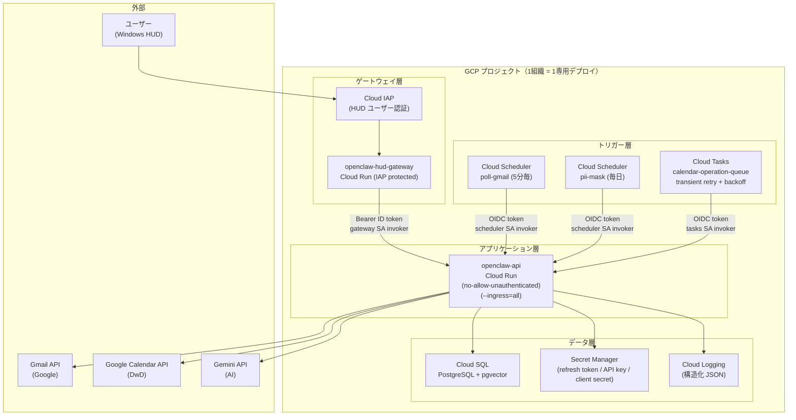

---

## 2. openclaw-api 内部構造（モジュラーモノリス）

```mermaid
flowchart TB
    subgraph OC_API["openclaw-api (Cloud Run プロセス)"]
        SERVER["api-server.js\n＝ Express アプリ + モジュールルーター"]

        subgraph CORE["src/core/ ── 全モジュール共有基盤"]
            AUTH["auth-middleware.js\nID token / OIDC token 検証\nHUD用とScheduler/Tasks用を分離"]
            DB["db-client.js\n接続プール管理\nadvisory lock API"]
            AI["ai-adapter.js\nGemini API 抽象化\nモデル切り替え口"]
            PII["pii-anonymizer.js\nAI送信前 PII 置換\n[REDACTED_EMAIL] / [PERSON_N]"]
            AUDIT["audit-logger.js\ntimeline_events 追記\nCloud Logging 構造化出力"]
            SECRET["secret-client.js\nSecret Manager 参照\nrefresh token rotation"]
        end

        subgraph MOD_GMAIL["src/modules/gmail/ ── Gmail ワークフロー"]
            GM_ROUTES["routes.js\n/internal/poll-gmail\n/v1/mail/*"]
            GM_POLLER["gmail-poller.js\nGmail History API\nmailbox checkpoint・bounded concurrency"]
            GM_AI["ai-analyzer.js\nカテゴリ/緊急度/返信要否/日程調整要否判定"]
            GM_RAG["rag-engine.js\nFAQ + sent reply embedding 検索\n返信案 context 生成"]
            GM_APPROVAL["approval-handler.js\napprovalToken + resource認可\nmail_send_operations 照合"]
            GM_LOCK["advisory lock\nnamespace 1: mailbox polling\n(pg_try_advisory_lock(1, hashtext(mailboxRef)))"]
            GM_MIG["migrations/gmail/\n001_emails.sql\n002_faq_entries.sql ..."]
        end

        subgraph MOD_CAL["src/modules/calendar/ ── Calendar ワークフロー"]
            CAL_ROUTES["routes.js\n/internal/calendar/operations/:id/execute\n/v1/calendar/*"]
            CAL_PLANNER["calendar-planner.js\nfree/busy 取得\n候補生成・スコアリング"]
            CAL_WORKER["calendar-worker.js\nexecution plan再検証\n冪等書込み・結果照合"]
            CAL_APPROVAL["approval-handler.js\napprovalToken/resource認可\noperation + outbox 同時作成"]
            CAL_OUTBOX["outbox-dispatcher.js\nlease + 決定的task name\nretry/dead-letter"]
            CAL_LOCK["advisory lock\nnamespace 2: Calendar operation\n(pg_try_advisory_lock(2, hashtext(operationId)))"]
            CAL_MIG["migrations/calendar/\n001_calendar_proposals.sql\n002_calendar_operations.sql ..."]
        end

        subgraph MOD_RETENTION["src/modules/retention/ ── PII 保持管理"]
            RET_ROUTES["routes.js\n/internal/retention/pii-mask"]
            RET_JOB["pii-retention.js\n90日超過 PII マスク処理\n対象件数・失敗件数のみ出力"]
            RET_LOCK["advisory lock\nnamespace 3: PII retention\n(pg_try_advisory_lock(3, 0))"]
            RET_MIG["migrations/retention/\n（既存テーブル操作・スキーマ変更なし）"]
        end

        subgraph MOD_NEW["src/modules/{new-feature}/ ── 将来追加モジュール"]
            NEW_ROUTES["routes.js\n/internal/new-feature/*\n/v1/new-feature/*"]
            NEW_LOGIC["new-feature.js"]
            NEW_LOCK["advisory lock\nnamespace 5+: 将来モジュール\n(pg_try_advisory_lock(N, hashtext(...)))"]
            NEW_MIG["migrations/{new-feature}/"]
        end

        SERVER --> MOD_GMAIL
        SERVER --> MOD_CAL
        SERVER --> MOD_RETENTION
        SERVER --> MOD_NEW

        MOD_GMAIL --> CORE
        MOD_CAL --> CORE
        MOD_RETENTION --> CORE
        MOD_NEW --> CORE
    end

    style CORE fill:#d1ecf1,stroke:#17a2b8
    style MOD_NEW fill:#fff3cd,stroke:#ffc107
```

---

## 3. リクエストルーティングと認証分岐

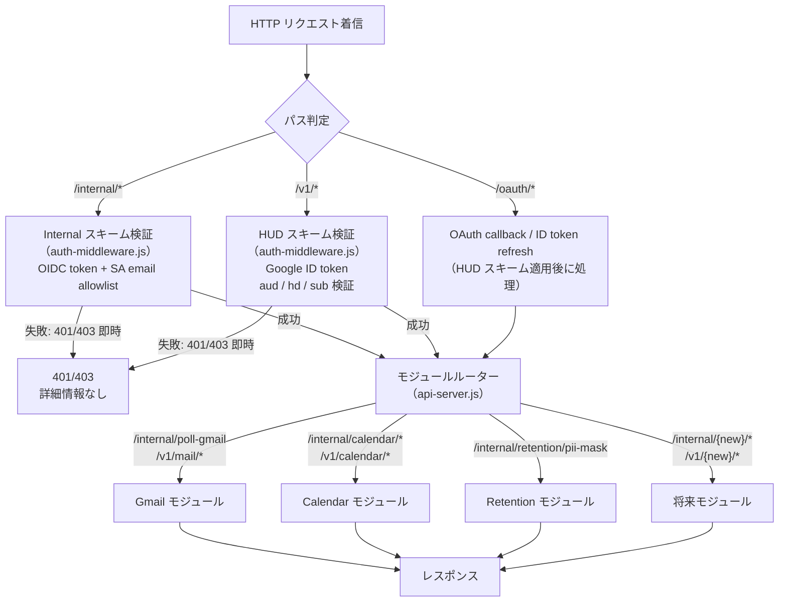

---

## 4. Flow 1: Gmail Polling（定期バッチ型）

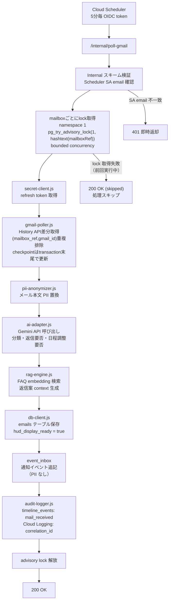

---

## 5. Flow 2: HUD 承認 → Gmail 送信

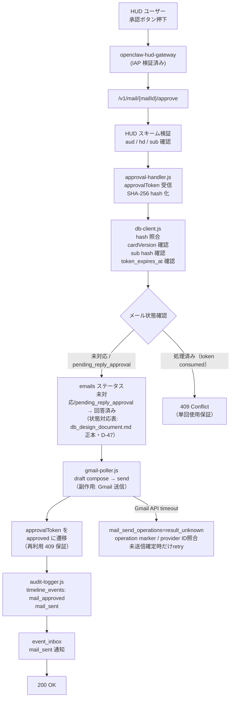

---

## 6. Flow 3: Calendar 候補生成 → HUD 提示

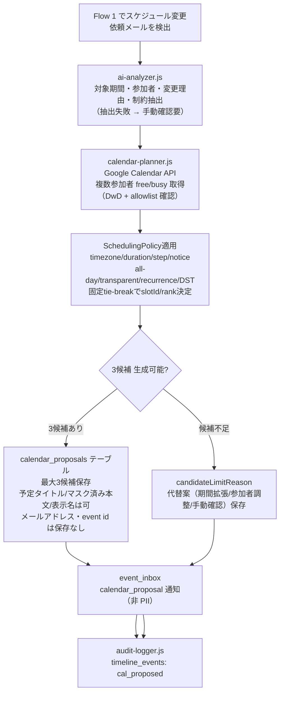

---

## 7. Flow 4: Calendar 承認 → Cloud Tasks → Calendar 書き込み

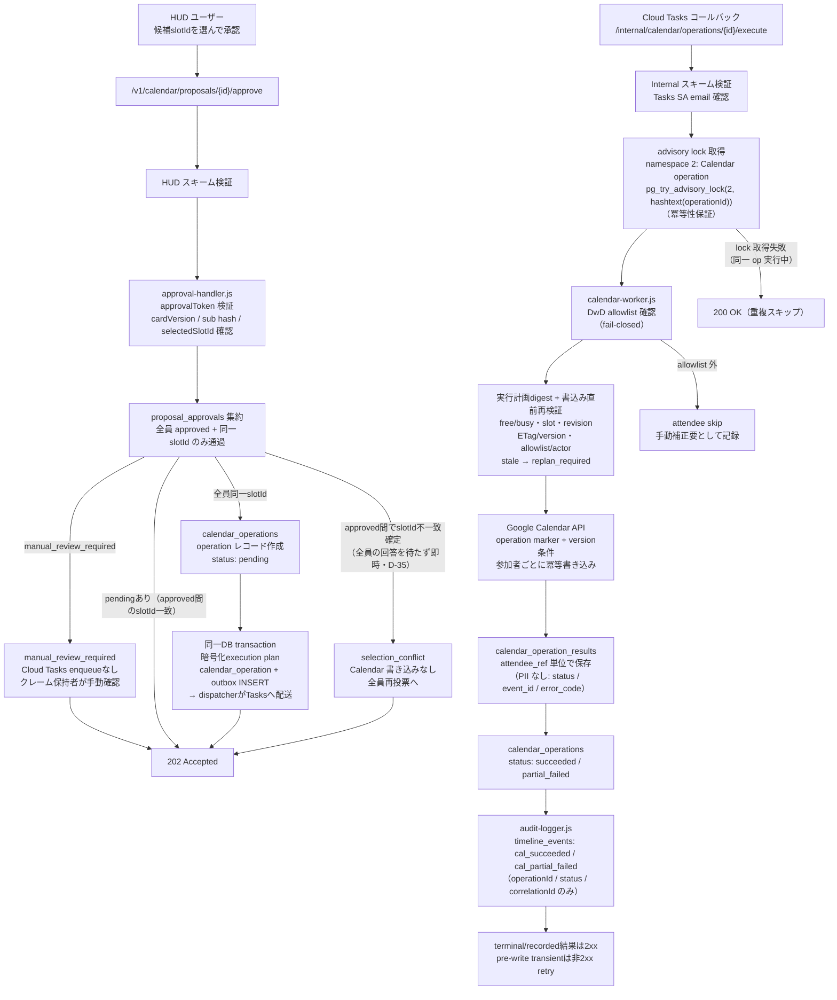

---

## 8. Flow 5: Calendar 拒否 / 候補割れ → 代替案再生成

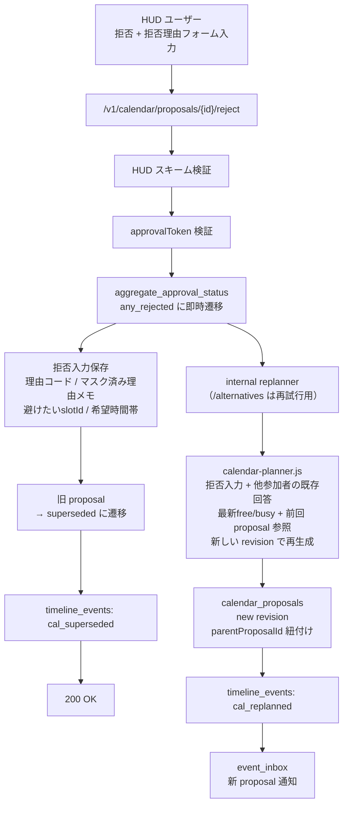

---

## 9. Flow 6: PII 保持期限処理（日次バッチ）

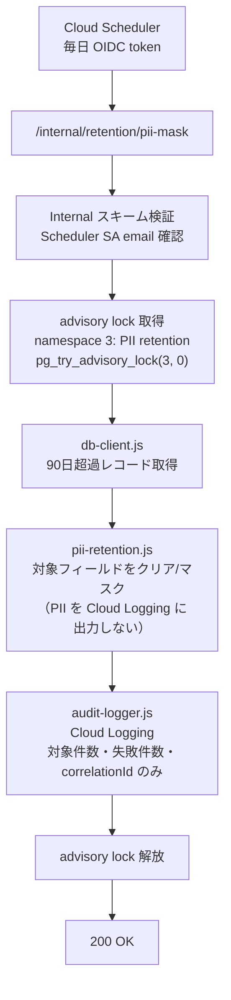

---

## 10. セキュリティ境界マップ

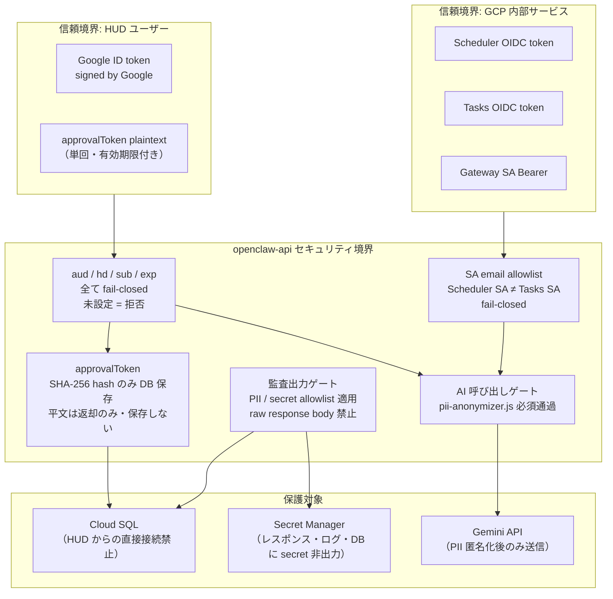

---

## 11. 新モジュール追加フロー

```mermaid
flowchart LR
    subgraph STEP1["Step 1 モジュール作成"]
        S1A["src/modules/{name}/\n  routes.js\n  {name}-service.js\n  approval-handler.js（必要時）"]
        S1B["migrations/{name}/\n  001_schema.sql"]
    end

    subgraph STEP2["Step 2 Core 層ルール確認"]
        S2A["db-client.js 経由で DB アクセス"]
        S2B["pii-anonymizer → ai-adapter の順で AI 呼び出し"]
        S2C["audit-logger.js で timeline_events 追記"]
        S2D["advisory lock namespace を feat:{name}-* に設定"]
    end

    subgraph STEP3["Step 3 ルーター登録"]
        S3["api-server.js に\nrequire('./modules/{name}/routes')\nの1行追加のみ"]
    end

    subgraph STEP4["Step 4 インフラ追加（Terraform 側）"]
        S4A["Cloud Scheduler ジョブ追加（バッチ型）"]
        S4B["Cloud Tasks キュー追加（非同期型）"]
        S4C["新 OAuth scope が必要な場合のみ\nOAuth 再同意フロー設計"]
    end

    STEP1 --> STEP2 --> STEP3 --> STEP4
```

---

## 12. ディレクトリ構成

```
openclaw-api/
  src/
    api-server.js
    core/
      auth-middleware.js
      db-client.js
      ai-adapter.js
      pii-anonymizer.js
      audit-logger.js
      secret-client.js
    modules/
      gmail/
        routes.js
        gmail-poller.js
        ai-analyzer.js
        rag-engine.js
        approval-handler.js
      calendar/
        routes.js
        calendar-planner.js
        calendar-worker.js
        approval-handler.js
      retention/
        routes.js
        pii-retention.js
      {new-feature}/
        routes.js
        {new-feature}-service.js
  migrations/
    gmail/
      001_emails.sql
      002_faq_entries.sql
      003_sent_reply_embeddings.sql
    calendar/
      001_calendar_proposals.sql
      002_calendar_operations.sql
      003_calendar_operation_results.sql
    {new-feature}/
      001_schema.sql
```
