> **DEPRECATED SNAPSHOT**: この図は旧12テーブルの関係確認用です。現行の`mailbox_poll_state`、`mail_send_operations`、`outbox_events`、`faq_candidates`、暗号化draft/plan、owner/BU境界を省略しています。DDL判断には`db_design_document.md v2.1`、実装後はmigrationを使用してください（D-30）。

# ER図

## 現在値に関する注意（2026-07-16）

このER図は旧12テーブル時点の概念図であり、現行24テーブルの物理ER図ではない。外部キー、制約、追加テーブルの確認には[`001_initial.sql`](../../../migrations/001_initial.sql)と[`002_remediation.sql`](../../../migrations/002_remediation.sql)を使用する。現行の機能別テーブル一覧は[現行実装ベースライン](../../implementation/current-implementation.md)に記載する。

## 目的

本文書は OpenClaw AI秘書システムの Cloud SQL PostgreSQL スキーマのエンティティ間リレーションを視覚化する。

## 対象範囲

旧12テーブルのみ。現行16テーブルはDB正本を参照する。

## 前提

- Cloud SQL PostgreSQL 15 + pgvector 拡張を前提とする
- embedding 型カラム（vector(768)）は ER 図では省略表記する
- 削除制約（CASCADE/RESTRICT/SET NULL）はリレーション注記に記載する
- `users.attendee_ref` は `emails.claimer_attendee_ref`・`event_inbox_recipients.target_user_ref`・`proposal_approvals.attendee_ref` 等から論理的に参照されるが、物理 FK は持たない（疑似識別子による疎結合設計）

## ER図

```mermaid
erDiagram
    users {
        UUID id PK
        TEXT google_subject_hash "UNIQUE NOT NULL; sha256(Google ID token sub)"
        TEXT attendee_ref "UNIQUE NOT NULL; random UUID, never name-derived"
        TEXT workspace_access_type "NOT NULL; personal_oauth or business_unit_dwd"
        TIMESTAMPTZ last_seen_at
        TIMESTAMPTZ created_at "NOT NULL DEFAULT now()"
        TIMESTAMPTZ updated_at "NOT NULL DEFAULT now()"
    }

    emails {
        UUID id PK
        TEXT gmail_id "NOT NULL; UNIQUE with mailbox_ref"
        TEXT thread_id "NOT NULL"
        TEXT mailbox_ref "NOT NULL; sha256(gmailAccount+perUserSalt) [C-17/D-22]"
        TEXT from_address "NOT NULL [PII]"
        TEXT subject "NOT NULL"
        TEXT body_preview "[PII]"
        TIMESTAMPTZ received_at "NOT NULL"
        TEXT status "NOT NULL DEFAULT '未対応'"
        TEXT category
        TEXT urgency
        TEXT summary
        TEXT actions
        TEXT sender_intent
        BOOLEAN reply_required "NOT NULL DEFAULT true"
        BOOLEAN is_schedule "NOT NULL DEFAULT false"
        TEXT scheduling_type
        JSONB proposed_datetimes
        JSONB participants "[PII]"
        TEXT draft_id
        TEXT approval_token_hash "SHA-256 only; plaintext never stored"
        TEXT approval_subject_hash "pseudonymous approver subject hash"
        INTEGER card_version "NOT NULL DEFAULT 1"
        TIMESTAMPTZ token_expires_at
        TIMESTAMPTZ approval_token_consumed_at
        TEXT claimer_attendee_ref "NULL=unclaimed [D-26/D-27]"
        TIMESTAMPTZ claimed_at "NULL=unclaimed; no auto timeout during pending_calendar [D-26]"
        BOOLEAN hud_display_ready "NOT NULL DEFAULT false"
        TIMESTAMPTZ pii_masked_at
        TIMESTAMPTZ created_at "NOT NULL DEFAULT now()"
        TIMESTAMPTZ updated_at "NOT NULL DEFAULT now()"
    }

    timeline_events {
        UUID id PK
        UUID mail_id "FK(emails) NULL"
        TEXT event_type "NOT NULL"
        TEXT operator "NULL or system id until legal approval"
        TEXT detail
        UUID correlation_id
        TIMESTAMPTZ timestamp "NOT NULL DEFAULT now()"
    }

    event_inbox {
        UUID event_id PK
        TEXT type "NOT NULL"
        UUID mail_id "FK(emails) NULL"
        TEXT operation_id "NULL"
        JSONB payload "NOT NULL"
        TIMESTAMPTZ created_at "NOT NULL DEFAULT now()"
    }

    event_inbox_recipients {
        UUID event_id PK "FK(event_inbox) NOT NULL"
        TEXT target_user_ref PK "attendee_ref recipient [D-22]"
        TIMESTAMPTZ acked_at "NULL=unacknowledged"
        TIMESTAMPTZ created_at "NOT NULL DEFAULT now()"
    }

    calendar_proposals {
        UUID proposal_id PK
        UUID parent_proposal_id "FK(calendar_proposals) NULL"
        INTEGER revision "NOT NULL DEFAULT 1"
        UUID mail_id "FK(emails) NOT NULL"
        TEXT scheduling_type "NOT NULL"
        JSONB proposed_datetimes
        JSONB conflict_info
        JSONB slots "NOT NULL; 0-3 candidates with slotId and participant contexts"
        TEXT context
        JSONB unavailable_attendees
        TEXT rejection_reason_code
        INTEGER candidate_count "NOT NULL DEFAULT 0"
        TEXT candidate_limit_reason
        JSONB alternative_suggestions
        JSONB manual_confirmation_prompt
        TEXT aggregate_approval_status "NOT NULL DEFAULT 'pending_all' [C-13/D-19]"
        TEXT status "NOT NULL DEFAULT 'active'; active/manual_review_required/execution_pending/executed/superseded/cancelled"
        TIMESTAMPTZ created_at "NOT NULL DEFAULT now()"
        TIMESTAMPTZ updated_at "NOT NULL DEFAULT now()"
    }

    proposal_approvals {
        UUID id PK
        UUID proposal_id "FK(calendar_proposals) NOT NULL"
        TEXT attendee_ref "NOT NULL; pseudonymous participant [C-13/D-19]"
        TEXT google_subject_hash "NOT NULL; approver identity check"
        TEXT status "NOT NULL DEFAULT 'pending'"
        TEXT approval_token_hash "SHA-256 only; plaintext never stored"
        INTEGER card_version "NOT NULL DEFAULT 1"
        TIMESTAMPTZ token_expires_at
        TEXT rejection_reason_code
        TEXT rejection_reason_detail
        JSONB rejected_slot_ids
        JSONB preferred_windows
        TEXT selected_slot_id
        TIMESTAMPTZ selected_slot_start
        TIMESTAMPTZ selected_slot_end
        TIMESTAMPTZ created_at "NOT NULL DEFAULT now()"
        TIMESTAMPTZ updated_at "NOT NULL DEFAULT now()"
    }

    calendar_operations {
        TEXT operation_id PK
        UUID proposal_id "FK(calendar_proposals) NOT NULL"
        UUID mail_id "FK(emails) NOT NULL"
        TEXT approver_user_id "NOT NULL pseudonymous subject"
        TIMESTAMPTZ selected_slot_start "NOT NULL"
        TIMESTAMPTZ selected_slot_end "NOT NULL"
        TEXT status "NOT NULL DEFAULT 'in_progress'"
        BOOLEAN manual_remediation_required "NOT NULL DEFAULT false"
        UUID correlation_id
        TIMESTAMPTZ created_at "NOT NULL DEFAULT now()"
        TIMESTAMPTZ updated_at "NOT NULL DEFAULT now()"
    }

    calendar_operation_results {
        UUID id PK
        TEXT operation_id "FK(calendar_operations) NOT NULL"
        TEXT attendee_ref "NOT NULL pseudonymous attendee"
        TEXT status "NOT NULL"
        TEXT event_id
        TEXT error_code
        TEXT api_correlation_id
        TIMESTAMPTZ updated_at "NOT NULL DEFAULT now()"
    }

    faq_entries {
        UUID id PK
        TEXT question "NOT NULL"
        TEXT answer "NOT NULL"
        TEXT category
        UUID source_mail_id "FK(emails) NULL"
        BOOLEAN pii_reviewed "NOT NULL DEFAULT false"
        VECTOR_768 embedding "pgvector省略表記"
        BOOLEAN is_active "NOT NULL DEFAULT true"
        TIMESTAMPTZ disabled_at
        TEXT created_by_attendee_ref "NOT NULL pseudonymous UUID; RC-FAQ-PII-001 CLOSED"
        TIMESTAMPTZ created_at "NOT NULL DEFAULT now()"
        TIMESTAMPTZ updated_at "NOT NULL DEFAULT now()"
    }

    sent_reply_embeddings {
        UUID id PK
        UUID mail_id "FK(emails) NOT NULL"
        TEXT anonymized_text
        VECTOR_768 embedding "pgvector省略表記"
        TIMESTAMPTZ pii_masked_at
        TIMESTAMPTZ created_at "NOT NULL DEFAULT now()"
    }

    settings {
        UUID id PK
        TEXT key "UNIQUE NOT NULL"
        JSONB value "NOT NULL"
        TIMESTAMPTZ updated_at "NOT NULL DEFAULT now()"
    }

    emails ||--o{ timeline_events : "mail_id (SET NULL)"
    emails ||--o{ event_inbox : "mail_id (SET NULL)"
    event_inbox ||--o{ event_inbox_recipients : "event_id (CASCADE)"
    emails ||--o{ calendar_proposals : "mail_id (CASCADE)"
    calendar_proposals ||--o{ calendar_proposals : "parent_proposal_id (SET NULL)"
    calendar_proposals ||--o{ proposal_approvals : "proposal_id (CASCADE)"
    emails ||--o{ calendar_operations : "mail_id (RESTRICT)"
    calendar_proposals ||--o{ calendar_operations : "proposal_id (RESTRICT)"
    emails ||--o{ faq_entries : "source_mail_id (SET NULL)"
    emails ||--o{ sent_reply_embeddings : "mail_id (RESTRICT)"
    calendar_operations ||--o{ calendar_operation_results : "operation_id (RESTRICT)"
```

## テーブル別 enum 一覧

### emails.status
`未対応`（返信要・スケジュールなし・HUD承認待ち）/ `pending_calendar`（スケジュール変更・Calendar承認待ち）/ `pending_reply_approval`（Calendar全員承認完了・返信承認待ち）/ `対応中` / `回答済み` / `解決済み` / `保留`

### event_inbox.type
`mail_approval_ready` / `mail_reply_ready` / `mail_claimed` / `mail_unclaimed` / `mail_transferred` / `calendar_proposals_ready` / `calendar_alternatives_ready` / `faq_candidate` / `calendar_operation_succeeded` / `calendar_operation_failed` / `critical_error` / `status_changed`

### timeline_events.event_type
`received` / `analyzed` / `hud_shown` / `approved` / `rejected` / `sent` / `mail_claimed` / `mail_unclaimed` / `mail_transferred` / `cal_participant_approved` / `cal_participant_rejected` / `cal_all_approved` / `cal_any_rejected` / `cal_selection_conflict` / `cal_succeeded` / `cal_partial_failed` / `cal_replanned` / `cal_candidate_limited` / `cal_superseded` / `faq_suggested` / `faq_registered` / `draft_saved` / `draft_deleted` / `error_minor` / `error_critical`

### calendar_proposals.aggregate_approval_status
`pending_all`（投票待ち）/ `all_approved`（全員が同一slotIdを承認 → operation enqueue）/ `any_rejected`（誰かが拒否 → 代替案フロー）/ `selection_conflict`（全員承認したがslotIdが割れた → 代替案フロー）

### calendar_proposals.status
`active`（承認収集中）/ `manual_review_required`（管理外必須参加者があり自動書き込み停止中）/ `executed`（Calendar operation dispatch済み）/ `superseded`（代替案で置換済み）

### proposal_approvals.status
`pending` / `approved` / `rejected`

## 注記

- `timeline_events` は追記専用テーブルであり、PostgreSQL トリガー（`trg_timeline_no_update` / `trg_timeline_no_delete`）により UPDATE・DELETE が禁止されている。削除ポリシーの例外なく、監査目的でレコードを永続保持する。
- `event_inbox` は通知本体テーブルであり、宛先と ACK 状態は `event_inbox_recipients` がユーザー単位で管理する。全 recipient 行が ACK 済みで、最後の `acked_at` から7日経過した event のみ物理削除する。
- `emails.pii_masked_at` と `sent_reply_embeddings.pii_masked_at` は retention job の完了マーカーである。`sent_reply_embeddings.anonymized_text` は90日後にクリアされるため NULL 許容とする。
- `faq_entries.is_active=false` と `disabled_at` は FAQ の soft delete を表す。pgvector検索は active なFAQのみを対象にする。
- `faq_entries.embedding` および `sent_reply_embeddings.embedding` カラムは Gemini API `models/text-embedding-004` の 768次元出力に合わせた `vector(768)` 型（pgvector）であり、ER 図では `VECTOR_768` と省略表記している。
- `calendar_operations.operation_id` は sha256(mailId+proposalId+selectedSlotId+slotStart+slotEnd+attendeeRefs+approvalSubjectHash) から生成される決定的 ID であり、重複 INSERT を `ON CONFLICT DO NOTHING` で防ぐ。
- `manual_review_required` proposal では管理外参加者の `proposal_approvals` 行を作成せず、`manual_confirmation_prompt` の確認対象として保持する。管理内参加者の承認が揃っても Calendar operation は enqueue しない。
- `calendar_operation_results` には `(operation_id, attendee_ref)` の UNIQUE 制約があり、UPSERT により冪等更新される。参加者メールアドレス・表示名は保存しない。
- `calendar_proposals` には `approval_token` / `approval_subject_hash` を直接持たない。per-participant approvalToken は `proposal_approvals` テーブルで管理する（C-13）。
- `proposal_approvals.approval_token_hash` は SHA-256 ハッシュのみを保存する。平文 approvalToken は認証済みカード取得レスポンス（GET /v1/calendar/proposals/{id}）でのみ返し、DB・event_inbox・ログには保存しない。
- `proposal_approvals.selected_slot_id` は参加者が承認した候補を表す。全員 approved でも `selected_slot_id` が一致しない場合は `selection_conflict` とし、Calendar 書き込みを行わない。
- `calendar_proposals.slots[].participantContexts` は候補ごとの全参加者の前後予定表示に使う。予定タイトル、マスク済み本文、参加者表示名は保持できるが、メールアドレス・Google event id・calendar id・会議URL・token は保持しない。
- `emails.claimer_attendee_ref` と `claimed_at` は BU 共有メールの先着クレーム排他制御に使用する。個人 mailbox のメールには設定しない（D-26/D-27）。2h タイムアウトは `GET /v1/mail/pending` 時にレイジー評価するが、`pending_calendar` 中は自動解除しない。
- `event_inbox_recipients.target_user_ref` は BU 共有メールイベントでは BU 全 members 分の行、個人 mailbox イベントでは本人1行を作る。`acked_at` が NULL の行だけが `GET /v1/events` の未読対象になる（D-22）。
- `users` テーブルは BU ユーザーのみ管理者が事前登録し（`POST /internal/admin/users`）、個人ユーザーは HUD 初回 OAuth 同意フロー完了時に自動登録される（D-25/BE-REQ-028）。
- `faq_entries.created_by_attendee_ref`はbackend生成疑似IDとし、OS username/email/display nameを保存しない（RC-FAQ-PII-001 CLOSED）。
- `settings` テーブルは他テーブルとの外部キーリレーションを持たない独立テーブルである。`businessUnits` は BU 共有 Gmail/Calendar アカウント、members、attendeeRef/titlePattern を保持する設定キーであり、欠落・null・空配列は fail-closed として扱う。

## 未確定事項

| ID | 内容 | 影響テーブル |
|---|---|---|
| OQ-DB-001 | **CLOSED: 2026-06-02** Gemini API `models/text-embedding-004` / 768次元を採用し、`vector(768)` を正式定義とする | faq_entries、sent_reply_embeddings |
| OQ-DB-002 | **CLOSED: 2026-06-04** emails の PII 保持期間はMVP既定90日。Cloud SQLバックアップ7日分は暗号化・IAM制限・保持期間明記で対応する | emails、sent_reply_embeddings 等 |
| OQ-DB-003 | **CLOSED: 2026-06-04** 追記専用 `timeline_events` とPII retentionの衝突。MVPは監査履歴をPII非保持に固定する | timeline_events |
| OQ-DB-006 | **CLOSED: 2026-06-04** `approval_token` のDB保存方式はSHA-256ハッシュ保存・平文event_inbox非保持を採用する | emails、proposal_approvals |
| RC-FAQ-PII-001 | **CLOSED 2026-07-15** `created_by_attendee_ref`へ置換 | faq_entries |

## 関連文書

- db_design_document.md v1.8
- requirements_definition.md v8.13（更新日 2026-07-07）
- docs/specs/gmail-ai-secretary/process_flow_design.md（更新日 2026-07-07）
