# Backend Process Flow: Gmail AI Secretary

## 実装同期状況（2026-07-16）

本書は完成時フローを含む。現行の実行可能フローは[現行実装ベースライン](../../implementation/current-implementation.md)を参照する。

| フロー | 現在の状態 |
|---|---|
| Gmail polling | History/list、lease、重複排除、暗号化保存まで実装。AI分析と返信draft生成は未実装で、`manual_action_required`へ遷移する |
| Gmail承認送信 | 送信台帳、Outbox、冪等send、reconcile、dead-letter replayまで実装 |
| Calendar承認 | proposal/approval/claim/cancel/alternative/state machineまで実装 |
| Calendar実行 | 保存済みslotの冪等event作成まで実装。freeBusy planner、実行直前再検証、DwDは未実装 |
| PII retention | hard TTL、ACK後削除、draft/operation cleanup、run記録まで実装 |

図中のAI/RAG、DwD、freeBusy、Cloud Tasks実接続は目標フローである。また、現行OAuth scopeにはCalendar scopeがないため、Google Calendarのstaging E2E前にscope追加と再同意を行う。

作成日: 2026-06-25 | 更新日: 2026-07-15 (D-37〜D-46 反映: OAuth bootstrap・resource認可・History差分・副作用照合・outbox・AI境界) | ステータス: DRAFT

## 凡例

| 表記 | 優先度 | 意味 |
|---|---|---|
| ❌ 赤ノード | A — 即時設計判断必要 | 本番事故リスクあり。要件・設計に即追記が必要 |
| ⚠️ 黄ノード | B — 設計追記必要 | 運用時の障害要因。設計フェーズ中に方針を決定する |
| 🔵 青ノード | C — 明示除外を検討 | MVP 外として除外するか設計判断が必要 |

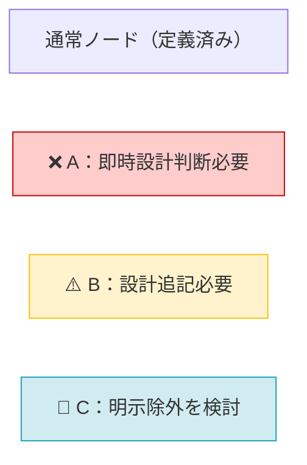

---

## Flow 1: Gmail Polling / Analysis / Reply Draft

1. `/internal/poll-gmail` が Scheduler OIDC token で呼び出される。
2. 対象 mailbox を列挙し、mailbox ごとの `pg_try_advisory_lock(1, hashtext(mailbox_ref))` と bounded concurrency 上限内で並列処理する。1 mailbox の失敗は他 mailbox へ波及させない。
3. `mailbox_poll_state.last_history_id` から Gmail History API を取得し、`(mailbox_ref,gmail_id)` で重複排除する。History ID 期限切れ時だけ限定 full sync を実施し、page 保存 transaction の最後に checkpoint を前進させる。
4. MAILER-DAEMON/multipart-report は `bounce_notice` に分岐する。通常メールだけを PII sanitizer に通し、本文を命令ではなく非信頼 data として AI analyzer へ渡す。
5. AI/RAG は version付きJSON Schema、列挙値、長さ、source allowlistで出力を検証する。失敗は `analysis_status=failed`、暗号化draft=NULL、`manual_action_required` として保存する。
6. **Branch A（スケジュール変更なし）**: Gmail draft 作成 → `emails.status = '未対応'` → metadata-only event を保存する。個人メールはowner tokenを発行し、BU共有メールはclaim前にtoken/draftを配らない。
7. **Branch B（スケジュール変更あり）**: Gmail draft 作成（保留） → `emails.status = 'pending_calendar'` → Calendar planner（Flow 4）を起動 → 全員承認（all_approved）時に**確定 slot 日時を差し込んで replyDraft を再生成・再暗号化し `card_version++`**（AI 失敗時は確定日時テンプレート + 元 draft にフォールバック。D-52）→ `emails.status = 'pending_reply_approval'` → `event_inbox: mail_reply_ready` を作成し Flow 2 へ（D-21 / D-22）。

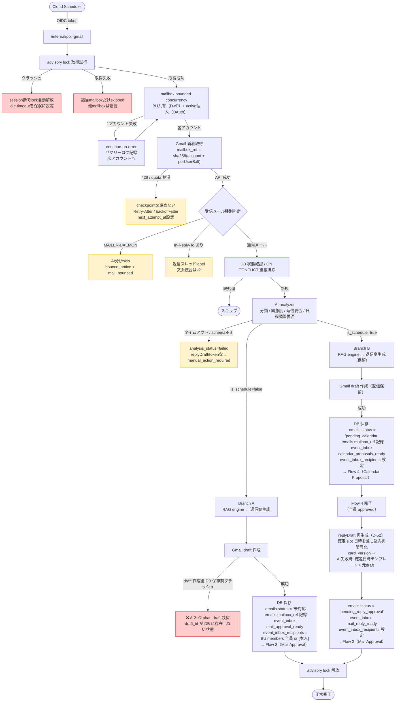

| ギャップ ID | 問題 |
|---|---|
| ✅ A-1 | 解決済み（D-36）: 全 lock を `pg_try_advisory_lock`（非ブロッキング）に統一し、取得失敗は 200 (skipped) 即返却（待機なし・タイムアウト定義不要）。クラッシュ時はセッション断で自動解放。保険として `idle_in_transaction_session_timeout` |
| ✅ A-2 | 解決済み（D-36 / BE-REQ-035）: emails 行を `status='processing'` で先行 INSERT → draft 作成 → draft_id UPDATE の順に変更。`processing` + `draft_id IS NULL` 行を次回ポーリングで検出し drafts.list で回復 |
| ✅ B-1 | 解決済み（D-36/D-44/D-45）: 429 は mailbox ごとに backoff + jitter、checkpoint を進めず再試行。AI失敗は schema化した `analysis_status=failed` + null draft の手動対応カード |
| ✅ B-2 | 解決済み（D-36 / BE-REQ-038）: 自送信への返信は「返信スレッド」ラベル付与のみ（文脈統合 AI 分析は v2） |
| ✅ B-3 | 解決済み（D-36 / BE-REQ-038）: MAILER-DAEMON / multipart-report は AI 分析スキップ、元メールに `mail_bounced` 記録、承認不要の通知カード |

---

## Flow 2: Mail Approval

1. HUD が `GET /v1/mail/pending` でカードを取得する。個人owner／BU current claimantだけが本文・暗号化解除したreplyDraft・approvalTokenを取得でき、同一BUの非claimantはmetadataとclaimRequiredだけを取得する。境界外resourceは404。
2. ユーザーが HUD でメール内容・タスク・下書きを確認し、承認または拒否を選択する。
3. 承認時：HUD が `POST /v1/mail/{mailId}/approve` を送信する。
4. Back が Google ID token、approvalToken hash、approval subject hash、cardVersion を検証する。
5. token消費と `mail_send_operations(prepared)` をtransactionで確定し、commit後に Gmail draft/send を実行する。
6. 各外部呼出し前後に draft_id/message_id/status を保存する。timeout時は operation marker と provider ID を照合し、送信済みなら成功、未送信確定時だけ再試行、判定不能なら `result_unknown` の手動確認カードにする。

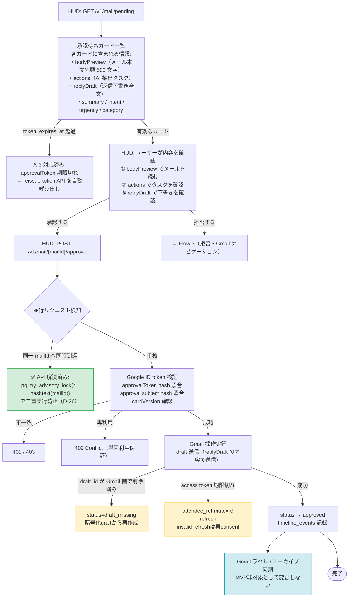

| ギャップ ID | 問題 |
|---|---|
| ✅ A-3 | 解決済み: 72h 有効期限 + HUD 自動再発行（reissue-token API）+ slot 陳腐化時 re-plan 促進 |
| ✅ A-4 | 並行承認競合：クレーム方式（第1層）+ pg_try_advisory_lock(4, hashtext(mailId))（第2層）の組み合わせで解決済み（D-26）。クレーム保持者のみが承認操作を実行でき、Gmail 送信直前に advisory lock で二重実行を防ぐ |
| ✅ B-4 | 解決済み（D-36 / BE-REQ-038）: 承認時 draft 404 → `status='draft_missing'` + HUD にエラー表示。replyDraft から draft 再作成可能 |
| ✅ B-5 | 解決済み（D-36）: refresh token rotation 不使用のため並行 refresh は無害（両 access token が有効）。インスタンス内は attendee_ref 単位の in-memory キャッシュ + mutex |
| ✅ C-3 | Gmail ラベル同期：requirements の Non-Goals に MVP 除外を明示済み |

---

## Flow 3: Mail Rejection（拒否 → Gmail ナビゲーション）

1. HUD が `POST /v1/mail/{mailId}/reject` を送信する。
2. Back が承認時と同じ token / version 検証を行う。
3. Gmail 下書きを削除し、`emails.status` を `rejected` に遷移する。
4. `timeline_events` に非 PII detail を保存する。
5. レスポンスに `gmailMessageId` を含めて返す。
6. **HUD がレスポンスの `gmailMessageId` を使い、元のメールを Gmail で開く**（ユーザーが手動で返信できる状態にする）。

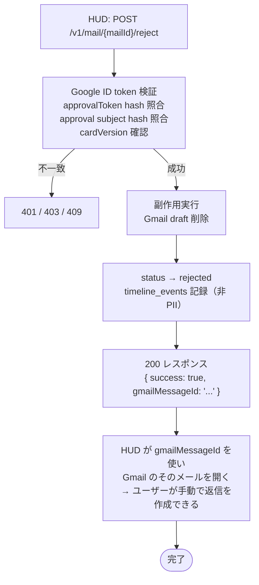

> Flow 3 は現時点で主要なギャップなし。`gmailMessageId` は非 PII の不透明 ID であり返却が安全。

---

## Flow 4: Calendar Proposal / Multi-party Approval / Operation

1. Back が日程調整対象メールを検出する。
2. AI analyzer が対象期間、参加者（事業部・役割）、変更理由、制約条件を抽出する。抽出不能時は手動確認要の候補不足状態にする。
3. Calendar planner が DwD パス（事業部共有カレンダー + titlePattern）と OAuth パス（個人 Workspace Calendar + freeBusy）の両ソースで管理内参加者の空き時間を取得しマージする。管理外参加者の空き状況は `unknown` として扱い、候補生成には使わない。
4. `SchedulingPolicy` の timezone、default duration、slot step、minimum notice、holiday/all-day/transparent/recurrence/DST規則を適用して候補を正規化する。前後context window内の予定は認証済みdetailでだけ扱い、メールアドレス・provider ID・会議URL・tokenは返さない。
5. canonical inputからslotIdを生成し、score後の同順位は `earliest_start` → `least_context_switching` → `lexical_slot_id` で決める。同一Calendar snapshotと設定から同じ最大3候補／rankを生成する。
6. 3候補を満たせない場合は、候補不足理由と期間拡張・期間外候補・参加者調整・手動確認の代替案を proposal に保存する。対象期間外候補は `isWithinRequestedPeriod=false` と `periodLabel=outside_requested_period` で明示する。
7. 管理外参加者（社外、AI秘書未導入、`users` 未登録）が必須参加者に含まれる場合でも、管理内参加者の空き状況から候補を生成する。ただし proposal は `status = manual_review_required`、`candidateLimitReason = external_manual_confirmation_required` とし、Calendar 自動書き込みを停止する。HUD はクレーム保持者向けの確認依頼テキストを表示し、手動確認に切り替える。
8. 通常 proposal では `proposal_approvals` を HUD 承認可能な参加者ごとに作成し、per-participant approvalToken（72h）を発行して event_inbox に通知する。`manual_review_required` proposal では管理外参加者には approvalToken / event_inbox を作成せず、`manual_confirmation_prompt` の確認対象として保持する。
9. 各参加者が自分の HUD で候補を1つ選んで承認、または拒否理由フォームを入力して拒否 API を呼ぶ。Back は `proposal_approvals` のその参加者の行に `selected_slot_id` または拒否入力を保存し、全行を集約確認する。
10. 通常 proposal で全員 approved かつ同一slotなら、aggregate更新、proposal=`execution_pending`、暗号化execution plan、`calendar_operations(dispatch_pending)`、`outbox_events`を1 transactionでcommitする。dispatcherが決定的task nameでCloud Tasksへ配送する。slot割れ／拒否／manual_reviewはoperationを作らない。
11. Calendar worker はplan digestを検証し、free/busy、slot freshness、proposal revision、target event ETag/version、allowlist/actorを直前再検証する。staleなら書込みなしで`replan_required`。書込み後timeoutはoperation marker/provider versionで照合し、attendee_ref単位で確定結果を保存する。全成功確認後だけproposal=`executed`とする。

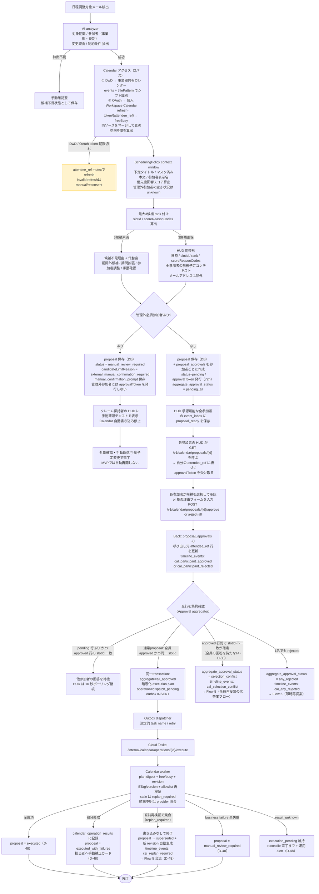

| ギャップ ID | 問題 |
|---|---|
| ✅ B-5 | 解決済み（D-36）: refresh token rotation 不使用のため並行 refresh は無害。インスタンス内は attendee_ref 単位の in-memory キャッシュ + mutex |
| ✅ OQ-MULTI-005 | CLOSED（D-34）: MVP は `POST /v1/calendar/proposals/{proposalId}/cancel`（クレーム保持者のみ）による手動キャンセルのみ。cancel で `emails.status` が `pending_reply_approval` に戻ると 2h クレームタイムアウトが復活し、保持者不在の詰みも解消。自動 stale 検出は v2（Flow 5-B 参照） |

---

### Flow 4-A: 管理外参加者の扱い（比較案）

管理外参加者とは、社外参加者、AI秘書未導入社員、`users` に存在せず HUD で承認できない参加者を指す。必須参加者に管理外参加者が含まれる場合、MVP では管理内参加者の空き状況だけで候補を作るが、Calendar 自動書き込みは停止し、proposal を `manual_review_required` としてクレーム保持者による手動確認に切り替える。

| 案 | 内容 | 利点 | リスク/却下理由 | 判定 |
|---|---|---|---|---|
| A. HUD確認テキスト + 手動確認 | HUD に候補日時・期間外ラベル・前後予定要約・確認依頼文を表示し、クレーム保持者が外部メール/チャットで確認する。proposal は `manual_review_required` として停止し、MVP では自動再開しない | 実装が軽く、社外相手にも使える。外部に認証リンクを配らないため安全 | 手動作業が残る。システム上の自動実行完了証跡は残らない | **MVP推奨** |
| B. 外部承認リンク | 社外参加者へ一時URLを送り、Webで承認/拒否してもらう | 自動化しやすい | 公開endpoint、本人確認、期限管理、誤転送対策、監査同意が必要でMVPには重い | v2以降 |
| C. クレーム保持者の代理承認 | クレーム保持者が外部確認結果を HUD に代理入力し、自動再開する | 最終実行までシステム内で完結しやすい | 代理入力の証跡・責任範囲が必要。本人が実際に承認したかをシステムだけでは保証できない | v2以降。Aの確認完了後の入力手段として検討 |
| D. 任意参加者として外す | 管理外参加者を必須から外して候補生成する | 日程候補を出しやすい | 必須参加者だった場合に業務事故になる | 任意参加者のみ可 |

MVP 推奨フロー:

1. AI analyzer / Calendar planner が管理外参加者を検出する。
2. 必須参加者なら管理内参加者の空き状況だけで最大3候補を作り、管理外参加者の availability は `unknown` とする。
3. proposal は `status = manual_review_required`、`candidateLimitReason = external_manual_confirmation_required`、`alternativeSuggestions = [manual_external_confirmation]` を設定する。
4. 管理外参加者には `proposal_approvals` 行、approvalToken、event_inbox 通知を作らない。HUD 承認可能な管理内参加者にだけ approvalToken を発行できる。
5. HUD はクレーム保持者に確認依頼テキストを表示する。候補日時、期間外ラベル、前後予定要約、確認依頼文は含めるが、メールアドレス・Google event id・calendar id・会議URL・token は含めない。
6. `manual_review_required` proposal は、管理内参加者の承認が揃っても Cloud Tasks に enqueue しない。MVP では外部確認後の自動再開を行わず、クレーム保持者が手動返信または手動予定変更で完了する。
7. 任意参加者なら `reduce_required_attendees` を代替案として提示できる。ユーザーが任意参加者を外す判断をした場合のみ、通常 proposal として承認集約へ進める。

---

## Flow 5: Calendar Rejection / Selection Conflict / Alternative Proposal（全員再投票）

1. Flow 4 で `aggregate_approval_status = any_rejected` または `selection_conflict` になった時点でトリガーされる。
2. 1名でも拒否した場合は、全員の回答完了を待たずに Back が internal replanner を即時起動する。HUD からの `POST /v1/calendar/proposals/{proposalId}/alternatives` は再試行・手動復旧用とする。
3. Back は拒否済み proposal・拒否者の理由コード/マスク済み理由メモ/避けたい slotId/希望時間帯・他参加者の既存回答・前回候補・最新 Calendar 空き状況・原因メールを取得し、新しい制約として Calendar planner に渡す。
4. Calendar planner は新しい proposal revision を作成し、旧 proposal を superseded に遷移する。**旧 proposal の `proposal_approvals` 行は不変のまま保持する（append-only。D-32）**。replanner は `parent_proposal_id` チェーンを遡って全 revision の `rejected_slot_ids` / `preferred_windows` を累積参照し、拒否済み slot を再提示しない。
5. **新 revision（新 proposal_id）に対して全参加者分の `proposal_approvals` 行を新規 INSERT** する（status=pending・新 approvalToken 発行）。全員再投票（D-20 / D-32）。
6. `timeline_events` に `cal_replanned`・`cal_candidate_limited`（候補不足時）・`cal_superseded` を非 PII detail で記録する。
7. 全参加者の event_inbox に新 proposal_ready 通知のみ保存し、approvalToken 平文・メールアドレス・既存予定タイトル/本文は保存しない。予定詳細は domain table の `calendar_proposals.slots[].participantContexts` から認証済み取得する。
8. 全参加者が新 proposal に対して再投票する → Flow 4 の承認集約フローへ戻る。
9. **レース応答（D-35）**: superseded 直後の最大10秒（HUD ポーリング遅延）の間に旧カードから届いた approve / reject は `409 + code: proposal_superseded + supersededByProposalId` を返し、HUD は新 proposal のカードへ自動遷移する。ほぼ同時に複数名が拒否した場合、2人目以降の拒否入力は新カード上で再入力する（デバウンス集約は v2）。
10. **終端保証（D-34）**: ① replan の結果が候補0件（slots=[]）の場合は `proposal_approvals` を作成せず `status = manual_review_required` に直行し、クレーム保持者へ手動対応カードを表示する。② `revision >= 3` の proposal からは replan せず `manual_review_required` / `candidateLimitReason = max_revisions_reached` に遷移する（無限再投票ループ防止）。

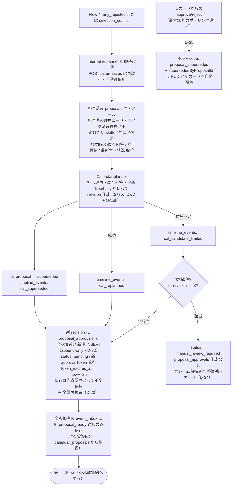

> Flow 5 は「1名拒否で即時再提案」を採用する。拒否者がなぜ拒否したかは構造化フォームで保存し、他参加者の既存回答と最新 Calendar 空き状況も replanner の入力に含める。OQ-MULTI-005（タイムアウト）は D-34 で CLOSED（Flow 5-B 参照）。

---

## Flow 5-B: Proposal 手動キャンセル（D-34 / OQ-MULTI-005 解決）

1. 参加者の一部が無回答のまま proposal が停滞した場合（reissue-token により token は自動更新され続けるため、システムは無期限に待機し得る）、クレーム保持者が HUD から `POST /v1/calendar/proposals/{proposalId}/cancel` を実行できる。
2. Back は担当者であることを検証する（BU 共有メール = current claimant / 個人 mailbox = `emails.owner_attendee_ref`。それ以外は 403、リソース非公開の場合は 404。D-49）。保持者不在時は Flow 7 の強制引き取り（24h 経過後）でクレームを取得してから cancel する。
3. proposal → `cancelled`、全 `proposal_approvals` を無効化、`timeline_events: cal_cancelled` を記録する。
4. `emails.status` を `pending_calendar` → `pending_reply_approval` に戻す。**この時点で 2h クレームタイムアウトの適用対象に復帰する**ため、保持者不在（退職・病欠）の詰みも 2h 後に他メンバーがクレーム可能になることで自動解消する。
5. cancel 後の返信は日程未確定の文面になるため、レスポンスの `gmailMessageId` を使った手動返信ナビゲーション（Flow 3 と同じ）へ誘導する。AI 返信案の再生成は v2。
6. cancelled proposal への approve / reject / reissue-token は `409 + code: proposal_superseded`（supersededByProposalId = null）を返す。

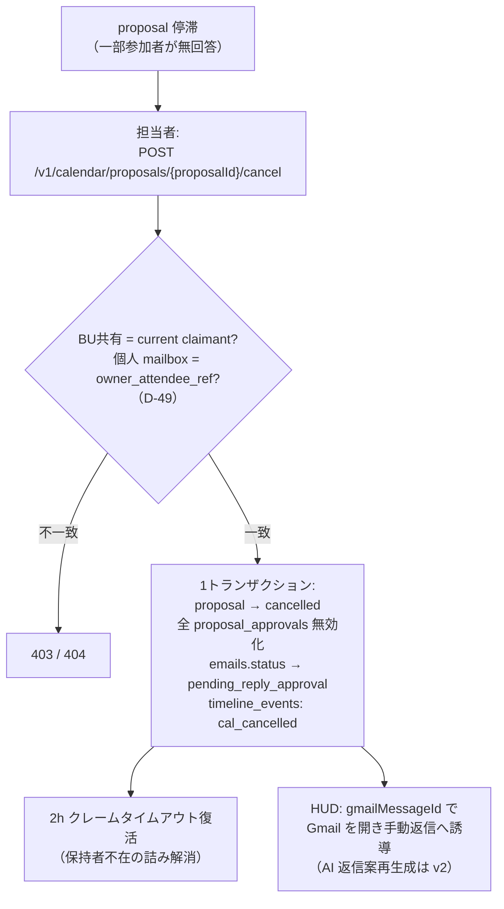

---

## Flow 6: PII Retention

1. Scheduler が `/internal/retention/pii-mask` を呼び出す。
2. Back が 90 日超過データを対象に PII field を mask / clear する。
3. 件数、失敗件数、correlation id のみを log に出す。

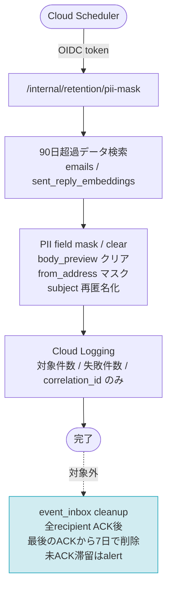

| ギャップ ID | 問題 |
|---|---|
| ✅ C-2 | 解決済み（D-45/BE-REQ-046）: 全recipient ACK後、最後のACKから7日で物理削除。未ACK滞留は運用alert対象 |

---

## Flow 7: BU 共有メール クレーム / 解除 / 移譲

1. BU 共有メールが HUD に表示される（event_inbox: mail_approval_ready、event_inbox_recipients = BU 全員）。
2. 手の空いたメンバーが「対応する」ボタンを押し、`POST /v1/mail/{mailId}/claim` でクレームを取得する。
3. Back が caller の active user／同一BU membershipを検証し、`emails.claimer_attendee_ref` の conditional UPDATE、`approval_subject_hash` bind、初回approvalToken hash/expiry発行、`card_version++` を1 transactionで行う。クレーム済みは409、境界外は404。
4. event_inbox: mail_claimed を BU 全員に metadata-only 配信する。token/draftはcurrent claimantがdetail APIを取得した時だけ返す。
5. クレーム保持者は Flow 2（Mail Approval）へ進み、Gmail 送信直前に `pg_try_advisory_lock(4, hashtext(mailId))` で二重実行を防ぐ。
6. クレーム保持者は作業を手放したい場合、解除または移譲を選択できる。

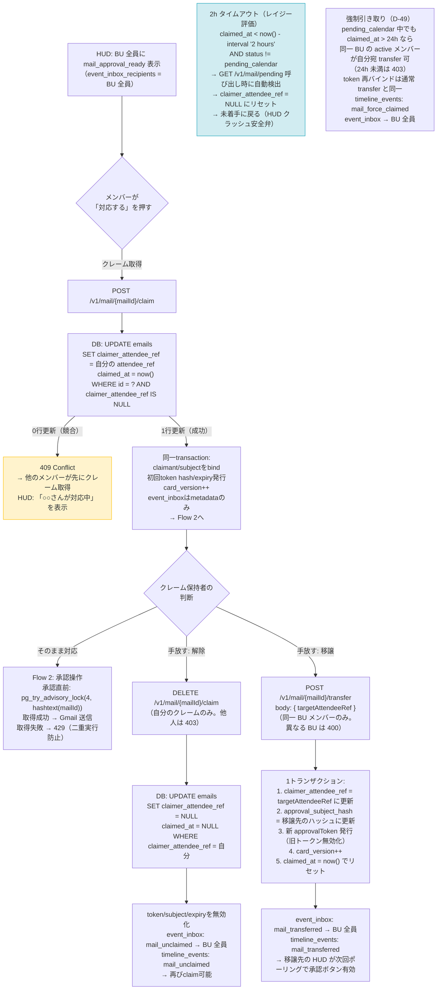

> Flow 7 の A-4 は advisory lock namespace=4 で解決済み。保持者不在デッドロック（cancel/unclaim/transfer が保持者限定 + pending_calendar 中タイムアウト停止の組み合わせ）は D-49 の強制引き取り（24h）で解消。

---

## 未考慮フロー

以下は Flow 1〜6 の補足記録。X1（B-3）・X2（B-2）は D-36 / BE-REQ-038 で方針決定済み（X1: AI分析skip + mail_bounced + bounce notice、X2: 返信スレッドlabelのみ・文脈統合はv2）。

### 未考慮フロー X1: バウンスメール検出（B-3 — 決定済み）

OpenClaw が送信した返信に対して配信失敗通知（MAILER-DAEMON）が届いた場合、現行 Flow 1 では通常メールとして AI 分析対象になる。

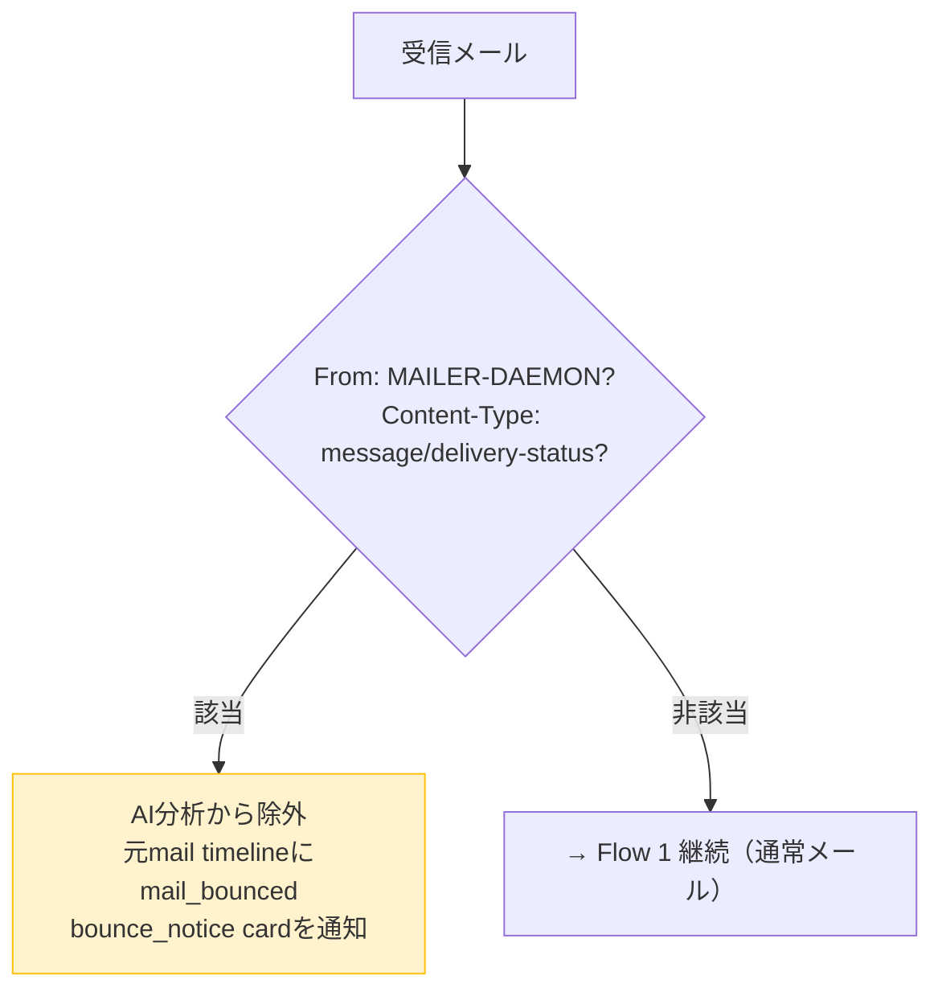

### 未考慮フロー X2: 返信メールのスレッド文脈処理（B-2 — 決定済み）

相手が OpenClaw の送信返信にさらに返信した場合、`In-Reply-To` / `References` ヘッダーで検出できる。現行フローではスレッド文脈なしで独立した新規メールとして解析される。

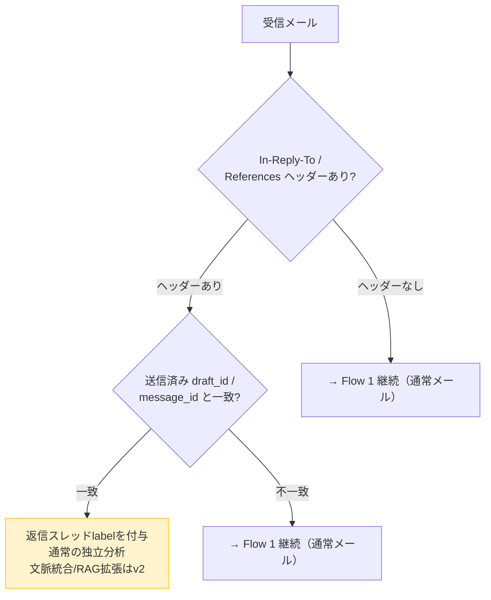

### フロー X3: approvalToken 期限切れ後の回復（A-3 — 決定済み）

`token_expires_at` は生成時から **72時間** とする（週末跨ぎ対応・陳腐化リスクのバランス）。
HUD がカードを取得した時点で `token_expires_at` を確認し、期限切れなら**自動で reissue-token API を呼んで透過的に更新**する（ユーザーは気づかない）。
Calendar 版は再発行時に slot の開始時刻が過去になっていた場合のみ re-plan を促す。

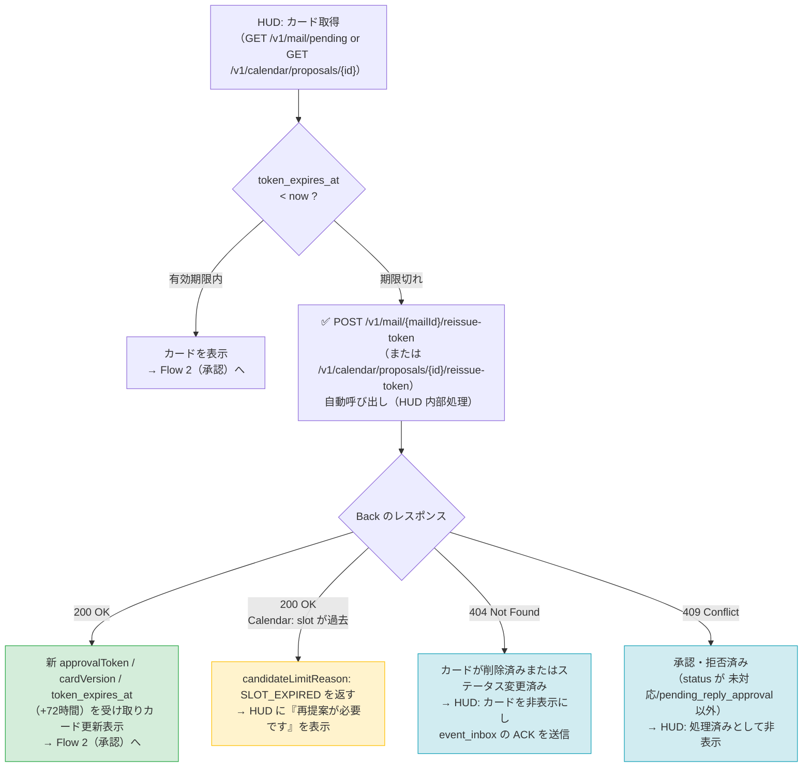

#### reissue-token API 仕様

| 項目 | メール版 | Calendar 版 |
|---|---|---|
| エンドポイント | `POST /v1/mail/{mailId}/reissue-token` | `POST /v1/calendar/proposals/{proposalId}/reissue-token` |
| 前提条件 | `status IN ('未対応', 'pending_reply_approval')`（状態対応表は db_design_document.md 正本。D-47） | `status = active` |
| 処理 | 新 `crypto.randomBytes(32)` 生成 → SHA-256 を DB 保存 → `token_expires_at = now + 72h` → `card_version++` → `timeline_events: token_reissued` | 同上 + slot の `startTime < now` 確認 → 過去 slot があれば `candidateLimitReason: SLOT_EXPIRED` で 200 を返す |
| レスポンス | `approvalToken`（平文）, `cardVersion`, `tokenExpiresAt` | 同上 + `slotExpired: bool` |
| 再発行上限 | なし（回数制限なし） | なし |
| PII | approvalToken 平文を event_inbox / log に出さない | 同左 + slot 内の予定詳細は認証済み proposal 取得でのみ返し、event_inbox / log / timeline_events には出さない |

---

## ギャップ一覧サマリー

| ID | 優先度 | 対象フロー | 問題概要 | 設計追記先 |
|---|---|---|---|---|
| A-1 | ✅ 決定済み | Flow 1 | 非ブロッキング lock 統一 + セッション断自動解放 + idle_in_transaction_session_timeout（D-36 / BE-REQ-036） | requirements_definition / db_design_document |
| A-2 | ✅ 決定済み | Flow 1 | emails 先行 INSERT（status='processing'）→ draft 作成 → draft_id UPDATE。processing + draft_id IS NULL 行を次回ポーリングで回復（D-36 / BE-REQ-035） | requirements_definition / db_design_document |
| G-1 | ✅ 決定済み | Flow 1 | BU 共有 Gmail と Calendar は同一アカウント。DwD で Gmail + Calendar 両スコープをカバー（D-21） | discovery-context / security_design |
| G-2 | ✅ 決定済み | Flow 1 / 4 | Gmail と Calendar は統合フロー。Branch B（スケジュール変更あり）は Calendar 承認完了後に返信承認カードを表示（D-21 / D-22） | process_flow_design |
| G-3 | ✅ 決定済み | Flow 1 | 個人ユーザーは単一 OAuth token（gmail + calendar 統合スコープ）で Gmail と Calendar 両方にアクセス（D-21） | security_design / requirements_definition |
| G-4 | ✅ 決定済み | Flow 1 / 2 | per-mailbox 可視性：BU 共有メールは BU members 全員表示、個人メールは本人のみ表示。`emails.mailbox_ref` + `event_inbox_recipients.target_user_ref` で制御（D-22） | db_design_document |
| G-5 | ✅ D-44で更新 | Flow 1 | mailbox別History checkpoint・mailbox lock・bounded concurrency・continue-on-error。D-23の逐次固定lockを上書き | process_flow_design / requirements_definition / db_design_document |
| G-6 | ✅ 決定済み | Flow 1 | Gmail 自己登録：個人ユーザーは HUD 初回起動時に OAuth 同意フローで Gmail を自己登録。BU 共有アカウントとの重複は 409（D-24 / C-16） | requirements_definition / design |
| A-3 | ✅ 決定済み | Flow 2 / X3 | approvalToken 期限切れ時の回復フロー → 72h 有効期限・HUD 自動再発行（reissue-token API）・slot 陳腐化時 re-plan 促進 | process_flow_design / requirements_definition / openapi.yaml |
| A-4 | ✅ 決定済み | Flow 2 | 並行承認競合：クレーム方式 + pg_try_advisory_lock(4, hashtext(mailId)) の組み合わせで解決（D-26） | db_design_document / requirements_definition |
| B-1 | ✅ D-44/D-45で更新 | Flow 1 | 429はmailbox checkpointを進めずbackoff+jitter。AI失敗はanalysis_status=failed/null draft/manual_action_required | requirements_definition / db_design_document |
| B-2 | ✅ 決定済み | Flow 1 / X2 | 自送信への返信は「返信スレッド」ラベル付与のみ。文脈統合 AI 分析は v2（D-36 / BE-REQ-038） | requirements_definition |
| B-3 | ✅ 決定済み | Flow 1 / X1 | MAILER-DAEMON / multipart-report は AI 分析スキップ + mail_bounced 記録 + 通知カード（D-36 / BE-REQ-038） | requirements_definition |
| B-4 | ✅ 決定済み | Flow 2 | draft 404 → status='draft_missing' + replyDraft から再作成（D-36 / BE-REQ-038） | requirements_definition / db_design_document |
| B-5 | ✅ 決定済み | Flow 2 / 4 | rotation 不使用のため並行 refresh は無害。in-memory キャッシュ + mutex（D-36） | design |
| C-2 | ✅ 決定済み | Flow 6 | event_inbox TTL / クリーンアップは requirements の Non-Goals に MVP 除外を明示済み | requirements_definition |
| C-3 | ✅ 決定済み | Flow 2 | Gmail ラベル / アーカイブ同期は requirements の Non-Goals に MVP 除外を明示済み | requirements_definition |
